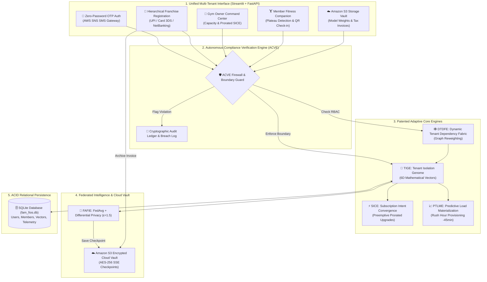

# FAM-FIOS: Federated Adaptive Multi-Tenant Fitness Infrastructure Operating System

[](./ci/github_actions_ci.yml)
[](https://www.python.org/downloads/)
[](https://streamlit.io/)
[](https://fastapi.tiangolo.com/)
[](https://github.com/tanishka360/fam-fios/actions)
[](https://aws.amazon.com/)
[](https://www.docker.com/)
[](https://vit.ac.in)

**FAM-FIOS** is an autonomous, privacy-preserving, AI-driven multi-tenant operating system designed for fitness facilities, franchise networks, and enterprise gym chains. Developed based on Invention Disclosure **24BIT0370-24BIT0390-IDF-01** (Vellore Institute of Technology, VIT SCORE), the platform coordinates cryptographic tenant isolation, preemptive capacity scaling, federated machine learning, Amazon S3 cloud checkpointing, AWS SNS zero-password OTP authentication, and multi-stage payment enrollment.

---

## 🏛️ System Architecture



---

## 🚀 Key System Portals & Features

The complete interactive operating system is delivered via **Streamlit** (`streamlit_app.py`), featuring 7 dedicated operational views:

### 1. 🔐 Zero-Password OTP Authentication (AWS SNS Integrated)
- **Passwordless Mobile & Email Login**: Members, trainers, and gym administrators authenticate without passwords using their registered Mobile Number (e.g. `+91 78880 85822`) or Email.
- **AWS SNS SMS Gateway**: Dispatches live one-time passwords via Amazon Simple Notification Service with E.164 phone formatting and carrier sandbox fallback.
- **Cryptographic OTP Generation**: 6-digit numeric OTPs generated via CSPRNG (`secrets.randbelow`) and verified using constant-time HMAC digest comparisons (`hmac.compare_digest`) to eliminate side-channel timing attacks.
- **1-Click Auto-Fill OTP**: Instant test fill button (`⚡ 1-Click Auto-Fill OTP`) alongside quick demo personas (**Tanishka Shah**, **Sarah Jenkins**, **Titan Executive Admin**, **Coach Alex**).
- **Role-Based Dynamic Redirection**:
  - **Members** ➔ Seamlessly routed to **Member Fitness Dashboard** with their personalized pass and attendance records.
  - **Admins** ➔ Routed to **Gym Owner Command Center** with full facility controls unlocked.

---

### 2. 📝 Member Registration & Multi-Stage Payment Gateway
- **Hierarchical City & Franchise Branch Architecture**:
  - **City-First Selection**: Prospective members select their city (**Pune**, **Bengaluru**, **Mumbai**, **Delhi NCR**, **Hyderabad**).
  - **Multi-Franchise Chains (e.g. Pune)**: Choose from 5 distinct franchise branches for the same brand:
    1. Baner High Street Franchise (Platinum Square, Baner)
    2. Kothrud (Paud Road) Franchise (City Pride Complex, Paud Road)
    3. Viman Nagar Franchise (Behind Phoenix Marketcity)
    4. Hinjewadi Phase 1 (IT Hub) Franchise (Rajiv Gandhi Infotech Park)
    5. Koregaon Park VIP Franchise (Lane 7, North Main Road)
- **Member Profile & Plan Selection**: Captures name, phone, email, age, gender, fitness goals, and membership duration (1 Month Standard, 3 Months Quarterly, 12 Months VIP) with itemized 18% GST calculation.
- **Dedicated Multi-Screen Payment Gateway**:
  - **📱 UPI Gateway**: Direct app push intents (**Google Pay**, **PhonePe**, **Paytm**, **CRED**, **BHIM**), high-resolution UPI QR code, and manual VPA collect request.
  - **💳 Card Gateway & 3D Secure OTP**: Credit/debit card form transitioning to an authentic **Bank 3D Secure OTP Verification Screen** (demo OTP: `742910`).
  - **🏛️ Net Banking Gateway**: Instant authorization across major banks (SBI, HDFC, ICICI, Axis, Kotak, PNB).
  - **⚡ 1-Click Fast Approval**: Quick-pass demo approval.
- **Tax Invoice & Digital Pass**: Itemized Tax Invoice (`TXN-2026-XXXX`), Bank RRN, and Official Digital Fitness Pass with security barcode.

---

### 3. 🏢 Gym Owner / Admin Command Center
- **Dynamic Capacity Tracking**: Real-time telemetry monitoring member counts vs. subscription tier limits (Free, Silver, Gold).
- **Live Member Roster**: Newly enrolled members appear synchronously at the top of the roster immediately upon payment completion.
- **Preemptive SICE Synthesis**: Automated generation of fair prorated tier upgrade orders before facility capacity breaches.
- **Peak Load Prediction (PTLME)**: Hourly attendance histograms predicting morning (6–9 AM) and evening (5–8 PM) rushes, spinning up server headroom 45 minutes in advance.
- **Tenant Isolation Genome (TIGE)**: Evolving tenant generation state, resource utilization, and health score.

---

### 4. 🗄️ Central Users & Members Database Explorer
- **Relational SQLite Database Viewer**: Inspects live tables (`users` and `members`) stored in `fam_fios.db`.
- **User Accounts (`users`)**: Manages PBKDF2 salted credentials, roles (`gym_admin`, `trainer`, `member`), phone numbers, cities, and branches.
- **Gym Members (`members`)**: Tracks member IDs, membership durations, base fees, GST, total amounts paid (₹), and enrollment timestamps.
- **Franchise Intelligence Analytics**:
  - Signups by City distribution chart.
  - Pune 5-Franchise breakdown chart (Baner, Kothrud, Viman Nagar, Hinjewadi, Koregaon Park).
  - Revenue contribution table by gym network.

---

### 5. 🏋️ Member Fitness Companion
- **Digital Gym Pass & QR Check-In**: Instant barcode check-in triggering attendance agent event logging.
- **Interactive Workout Logger**: Logs exercise sets, reps, load (kg), and RPE ratings.
- **Altair Fitness Plateau Detector**: Visual line charts detecting workout stagnation across volume, sets, and rep ranges.
- **AI Workout & Meal Guide**: Dynamic fitness plans tailored to member goals (Hypertrophy, Fat Loss, Powerlifting, Conditioning).

---

### 6. ☁️ Amazon S3 Cloud Storage Vault
- **Encrypted Model Checkpoints**: Automatically vaults federated neural network weights (`s3://fam-fios-cloud-vault/fafie/rounds/{round_id}/weights.json`) with server-side encryption (`AES-256 / KMS`).
- **Member Tax Invoice Archiving**: Digital passes and tax invoices archived permanently upon payment authorization.
- **Live S3 Object Explorer**: Direct view into cloud bucket metrics, regions, and file archives.

---

### 7. 🔬 Patent & Architecture Deep-Dive
- Visual interactive breakdown of the 10 patent-pending engines from Invention Disclosure `24BIT0370-24BIT0390-IDF-01`.
- Interactive simulation of cross-tenant unauthorized intrusion attempts and ACVE security firewall interception.

---

## 🧠 Core Architectural Modules (Invention Disclosure)

| Engine | Name | Primary Function |
| :--- | :--- | :--- |
| **TIGE** | Tenant Isolation Genome Engine | Models each gym as an executable digital object with evolving Subscription, Usage, RBAC, Resource, Compliance, and Trust vectors. |
| **DTDFE** | Dynamic Tenant Dependency Fabric Engine | Dynamic graph modeling tenant-role-resource dependencies with adaptive enforcement weights. |
| **SICE** | Subscription Intent Convergence Engine | Pre-emptive capacity monitoring and automated prorated upgrade synthesis ahead of limit breaches. |
| **FAFIE** | Federated Adaptive Fitness Intelligence Engine | Privacy-preserving cross-gym collaborative AI (FedAvg + Differential Privacy $\epsilon=1.5$) with local plateau detection. |
| **PTLME** | Predictive Tenant Load Materialization Engine | Demand-driven pre-emptive compute/partition provisioning 45 minutes before morning and evening rush hours. |
| **ACVE** | Autonomous Compliance Verification Engine | Pre-execution firewall enforcing multi-tenant isolation, RBAC, quotas, and cross-facility boundaries. |
| **TEFR / TEK** | Execution Fragment Repository & Evolution Kernel | Closed-loop operational telemetry ledger and parameter adaptation engine. |

---

## 🧪 Comprehensive Automated Test Matrix (35 Tests Passing)

All 35 unit and integration tests execute with a 100% pass rate:

```powershell
pytest backend/tests -v
```

| Test Suite | Module Scope | Status |
| :--- | :--- | :--- |
| `test_acve.py` | ACVE cross-tenant isolation firewall & RBAC interception | **PASSED (2/2)** |
| `test_auth_and_db.py` | PBKDF2 hashing, JWT verification, SQLite ORM, tenant boundaries | **PASSED (5/5)** |
| `test_aws_s3.py` | Amazon S3 encrypted vault, Boto3 client mock, FAFIE checkpointing | **PASSED (6/6)** |
| `test_aws_sns.py` | AWS SNS E.164 phone normalization, SMS push simulation, Boto3 dispatch | **PASSED (5/5)** |
| `test_closed_loop.py` | Complete closed-loop federated telemetry & genome adaptation | **PASSED (1/1)** |
| `test_closed_loop_failure.py` | Failure injection, ACVE halt verification, TEK penalty convergence | **PASSED (2/2)** |
| `test_dtdfe.py` | Dynamic tenant dependency fabric graph reweighting | **PASSED (1/1)** |
| `test_fafie.py` | Collaborative FedAvg aggregation & plateau detection | **PASSED (2/2)** |
| `test_fafie_privacy_magnitude.py` | Differential privacy noise bounds, gradient clipping, sample protection | **PASSED (4/4)** |
| `test_otp.py` | CSPRNG 6-digit OTP generation, expiry timers, single-use security | **PASSED (3/3)** |
| `test_ptlm.py` | Predictive peak demand pre-allocation (-45 minutes) | **PASSED (1/1)** |
| `test_sice.py` | Capacity threshold breach prediction & prorated upgrade synthesis | **PASSED (1/1)** |
| `test_tig.py` | TIGE genome vector initialization, mutations, and cryptographic hashing | **PASSED (2/2)** |
| **Total** | **35 Test Cases Across 13 Modules** | **100% PASS** |

---

## 🌐 1-Click Deployment Options

### Option A: Streamlit Community Cloud (Instant Free 24/7 Hosting)
1. Fork or open [tanishka360/fam-fios](https://github.com/tanishka360/fam-fios).
2. Log into [share.streamlit.io](https://share.streamlit.io) with your GitHub account.
3. Click **New app** and select:
   - **Repository**: `tanishka360/fam-fios`
   - **Branch**: `main`
   - **Main file path**: `streamlit_app.py`
4. Click **Deploy!** — your system will receive a permanent live URL (e.g. `https://fam-fios.streamlit.app`).

### Option B: Docker Containerization
Run FAM-FIOS in an isolated production container:
```bash
docker compose up --build
```
Access at **http://localhost:8501**.

### Option C: AWS App Runner & Amazon ECS Fargate
Deploy directly to enterprise AWS infrastructure without local Docker. See [`AWS_DEPLOYMENT_GUIDE.md`](./AWS_DEPLOYMENT_GUIDE.md) and execute [`deploy_aws.ps1`](./deploy_aws.ps1).

---

## 👥 Demo Personas for Instant Testing

| Persona | Role | Facility & Branch | Demo Mobile / Email |
| :--- | :--- | :--- | :--- |
| **Tanishka Shah** | Member | Titan Fitness — Baner High Street Franchise | +91 78880 85822 / tanishkashahpune@gmail.com |
| **Sarah Jenkins** | Member | Apex Elite — Kalyani Nagar Branch | +91 98233 30002 / member@apexfitness.com |
| **Titan Executive** | Gym Admin | Titan Fitness Network (Gold Enterprise) | +91 98231 10001 / admin@titan.com |
| **IronCore Manager** | Gym Admin | IronCore Athletic Club (Silver Tier) | +91 98232 20001 / admin@ironcore.com |
| **Coach Alex** | Trainer | IronCore — Senapati Bapat Road Franchise | +91 98232 20002 / trainer@ironcore.com |

---

## 📜 Patent Citation & Research Attribution

> **Invention Disclosure:** *Federated Adaptive Multi-Tenant Fitness Infrastructure Operating System (FAM-FIOS)*  
> **Reference ID:** `24BIT0370-24BIT0390-IDF-01`  
> **Institution:** Vellore Institute of Technology (VIT SCORE)  
> **Authors:** Tanishka Shah & Research Collaborators
