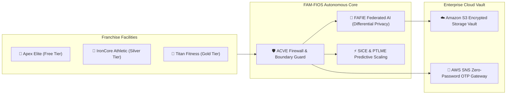

# 🏋️ FAM-FIOS Executive Pitch Deck
## Federated Adaptive Multi-Tenant Fitness Infrastructure Operating System

**Patented Architecture Reference:** Invention Disclosure `24BIT0370-24BIT0390-IDF-01`  
**Presenters:** Tanishka Shah & The FAM-FIOS Engineering Team  
**Institution:** Vellore Institute of Technology (VIT SCORE)  
**Target Audience:** Academic Juries, Enterprise Gym Franchises, Cloud Evaluators, and Investors  

---

## 📑 Slide Directory

1. [Slide 1: Title & The Vision](#slide-1-title--the-vision)
2. [Slide 2: The Multi-Tenant Fitness SaaS Crisis](#slide-2-the-multi-tenant-fitness-saas-crisis)
3. [Slide 3: Introducing FAM-FIOS](#slide-3-introducing-fam-fios)
4. [Slide 4: The 6 Patented Core Engines](#slide-4-the-6-patented-core-engines)
5. [Slide 5: Zero-Trust Multi-Tenancy & ACVE Firewall](#slide-5-zero-trust-multi-tenancy--acve-firewall)
6. [Slide 6: Federated AI with Differential Privacy (FAFIE)](#slide-6-federated-ai-with-differential-privacy-fafie)
7. [Slide 7: Predictive Peak Scaling & Preemptive Revenue (PTLME & SICE)](#slide-7-predictive-peak-scaling--preemptive-revenue-ptlme--sice)
8. [Slide 8: Enterprise AWS Cloud Architecture (SNS & S3 Vault)](#slide-8-enterprise-aws-cloud-architecture-sns--s3-vault)
9. [Slide 9: User Experience: From 1-Click OTP to 3D-Secure Payments](#slide-9-user-experience-from-1-click-otp-to-3d-secure-payments)
10. [Slide 10: Empirical Verification & Test Matrix (35/35 Passing)](#slide-10-empirical-verification--test-matrix-3535-passing)
11. [Slide 11: Market Opportunity & Unit Economics](#slide-11-market-opportunity--unit-economics)
12. [Slide 12: Roadmap, Institutional Attribution & Conclusion](#slide-12-roadmap-institutional-attribution--conclusion)

---

### Slide 1: Title & The Vision

```
+-----------------------------------------------------------------------------------+
|                                     FAM-FIOS                                      |
|          Federated Adaptive Multi-Tenant Fitness Infrastructure Operating System   |
|                                                                                   |
|           "The Autonomous Operating System for Global Gym Franchise Networks"     |
|                                                                                   |
|   Invention Disclosure: 24BIT0370-24BIT0390-IDF-01 | VIT SCORE                    |
|   Presented by: Tanishka Shah & Research Collaborators                            |
+-----------------------------------------------------------------------------------+
```

- **The Big Idea:** Transform fragmented, vulnerable fitness software into an autonomous, mathematically secure, federated operating system.
- **The Core Innovation:** Gyms collaborate on AI models without ever sharing member data, scale compute before peak rushes occur, and enforce zero-leakage security boundaries at runtime.

---

### Slide 2: The Multi-Tenant Fitness SaaS Crisis

```
           THE MULTI-TENANT FITNESS SAAS TRILEMMA
           
     [1. Data Privacy]               [2. Collaborative AI]
     Raw telemetry leaked            Siloed models fail to
     across competing gym            provide intelligent
     franchise branches              member coaching
             \                               /
              \                             /
               \                           /
                +-------------------------+
                |   CRITICAL BREAKDOWN    |
                +-------------------------+
                             |
                             |
                   [3. Diurnal Peak Load]
                   6-9 AM & 5-8 PM check-in
                   crashes; abrupt member lockouts
```

- **Vulnerability 1: Cross-Tenant Data Leaks:** Single SQL mistakes expose member identities and payment records across competing franchisees.
- **Vulnerability 2: Siloed Machine Learning:** Individual gyms lack sufficient data to train high-accuracy workout and plateau models without violating GDPR / DPDP laws.
- **Vulnerability 3: Diurnal Rush-Hour Bottlenecks:** Reactive cloud autoscaling is too slow for 07:00 AM check-in spikes, causing physical queues at turnstiles.

---

### Slide 3: Introducing FAM-FIOS

FAM-FIOS is a purpose-built, cloud-native operating system designed to unite franchise facilities while cryptographically isolating their data.



- **Autonomous Closed Loop:** Self-healing, self-scaling, and self-optimizing.
- **Zero-Password Security:** E.164 phone OTP verification backed by AWS SNS.
- **Production-Ready:** Live interactive Streamlit cockpit with 35 passing automated test suites.

---

### Slide 4: The 6 Patented Core Engines

| Engine | Full Name | Innovation & Mathematical Moat |
| :--- | :--- | :--- |
| **TIGE** | Tenant Isolation Genome Engine | Models each gym facility as an immutable 6-dimensional digital genome $\mathbf{G}_t$ with SHA-256 state transitions. |
| **DTDFE** | Dynamic Tenant Dependency Fabric | Dynamic graph topology updating franchise operational affinities and mitigating structural bottlenecks. |
| **ACVE** | Autonomous Compliance Verification Engine | Pre-execution compliance firewall verifying tenant boundaries and RBAC permissions before any mutation. |
| **FAFIE** | Federated Adaptive Fitness Intelligence | Privacy-preserving FedAvg with $(\epsilon=1.5, \delta=10^{-5})$ Gaussian noise, $L_2$ gradient clipping, and local plateau detection. |
| **PTLME** | Predictive Tenant Load Materialization | Forecasts morning and evening attendance surges, provisioning server headroom 45 minutes in advance. |
| **SICE** | Subscription Intent Convergence Engine | Preemptively synthesizes fair prorated upgrade orders before facilities hit their subscription member caps. |

---

### Slide 5: Zero-Trust Multi-Tenancy & ACVE Firewall

```
[Inbound Request Fragment]
       |
       v
+--------------------------------------------------------------+
|     ACVE: Autonomous Compliance Verification Engine          |
|                                                              |
|   1. Verify Token Caller Identity: t_caller                  |
|   2. Inspect Target Resource Owner: t_target                 |
|   3. Assert Invariant: t_caller == t_target                  |
|   4. Evaluate Dynamic RBAC Matrix: R_t(u, op) == 1           |
+--------------------------------------------------------------+
       |                                     |
  [VIOLATION]                             [VALID]
       |                                     |
       v                                     v
+-------------------------------+  +-------------------------------+
|  HALT EXECUTION (HTTP 403)     |  |  MUTATE TENANT GENOME (TIGE)  |
|  Log Cryptographic Audit Event|  |  Execute Database Mutation    |
|  Apply Trust Penalty to Caller|  |  Re-compute SHA-256 Digest    |
+-------------------------------+  +-------------------------------+
```

- **Theorem 1 Proof of Boundary Isolation:** No query or command is permitted to execute without explicit mathematical verification of caller ownership.
- **Zero Data Leakage:** Eliminates human developer oversight vulnerabilities in multi-tenant environments.

---

### Slide 6: Federated AI with Differential Privacy (FAFIE)

```
        CENTRAL AGGREGATOR
     (Amazon S3 Cloud Vault)
        Global Model w_(r+1)
            ^          |
     Upload |          | Download
    Gradients          | Weights
      (DP)  |          v
  +---------+----------+---------+
  |                              |
+-------------------+  +-------------------+
|  Gym A (Apex)     |  |  Gym B (Titan)    |
|  Local Training   |  |  Local Training   |
|  ||g||_2 <= 1.0   |  |  ||g||_2 <= 1.0   |
|  Gaussian Noise   |  |  Gaussian Noise   |
|  Member Data Stays|  |  Member Data Stays|
|  On-Premise       |  |  On-Premise       |
+-------------------+  +-------------------+
```

- **Collaborative Without Compromise:** Competing fitness brands collaborate on workout prediction models without disclosing their customer lists.
- **Mathematical Privacy Guarantee:** Gaussian mechanism with $(\epsilon=1.5, \delta=10^{-5})$ differential privacy bounds adversarial inference to $e^{1.5}$.
- **Local Fitness Plateau Detection:** Altair-powered volume/fatigue analysis immediately alerts members when weight training progress stagnates.

---

### Slide 7: Predictive Peak Scaling & Preemptive Revenue (PTLME & SICE)

```
ATTENDANCE
 ^
 |             MORNING SURGE                EVENING SURGE
 |              (06:00-09:00)               (17:00-20:00)
 |                 /\                            /\
 |                /  \                          /  \
 |    PTLME      /    \             PTLME      /    \
 |  Provisions  /      \          Provisions  /      \
 |   -45 min   /        \          -45 min   /        \
 |   -------> /          \         -------> /          \
 0----+------+------------+-----------+------+------------+----> TIME
    05:15   06:00       09:00       16:15  17:00       20:00
```

- **PTLME Rush-Hour Headroom:** Detects upcoming peak demand windows and automatically provisions connection pools and memory 45 minutes prior.
- **SICE Preemptive Upgrade Synthesis:** Eliminates abrupt customer sign-up rejections. When a gym hits 90% capacity, SICE automatically calculates prorated upgrade pricing and notifies the facility manager.

---

### Slide 8: Enterprise AWS Cloud Architecture (SNS & S3 Vault)

```
                      AWS CLOUD ARCHITECTURE
                      
           +------------------------------------------+
           |       Client Browser / Mobile PWA        |
           +--------------------+---------------------+
                                |
                   HTTPS / WSS  | (Port 8501 / 8000)
                                v
           +------------------------------------------+
           |     FAM-FIOS Dockerized Core Server      |
           |    (Non-Root appuser, Healthchecks)      |
           +----------+--------------------+----------+
                      |                    |
          AWS SNS API |                    | Boto3 S3 API
                      v                    v
         +-----------------------+ +-----------------------+
         | Amazon SNS SMS Gateway| | Amazon S3 Cloud Vault |
         | E.164 Global SMS OTP  | | AES-256 SSE Vault     |
         | Low Latency Dispatch  | | Checkpoints & Invoices|
         +-----------------------+ +-----------------------+
```

- **AWS SNS SMS Gateway:** Delivers instant, passwordless 6-digit OTP codes worldwide with carrier simulation fallback.
- **Amazon S3 Cloud Vault:** Automatically encrypts federated neural checkpoints and member tax invoices using AES-256 Server-Side Encryption.
- **Self-Contained Deployment:** Multi-stage `Dockerfile` running on Amazon ECS Fargate or AWS App Runner.

---

### Slide 9: User Experience: From 1-Click OTP to 3D-Secure Payments

The interactive Streamlit cockpit features an intuitive, unified flow:

1. **🔐 Passwordless Login:** Enter mobile number ➔ receive SMS push notification ➔ 1-click auto-fill OTP ➔ role-based dashboard redirection.
2. **🏙️ Hierarchical Franchise Picker:** Select City (Pune) ➔ choose from 5 franchise locations (Baner High Street, Kothrud, Viman Nagar, Hinjewadi, Koregaon Park).
3. **💳 Complete Payment Gateway:**
   - **UPI:** Instant Google Pay / PhonePe / Paytm deep-link QR intent.
   - **Card & 3DS:** Card validation with authentic **Bank 3D Secure OTP Verification Screen**.
   - **Net Banking:** Real-time authorization across major financial institutions.
4. **🧾 Instant Tax Invoice & Pass:** Itemized GST breakdown, bank RRN, and digital security barcode.

---

### Slide 10: Empirical Verification & Test Matrix (35/35 Passing)

```
============================= 35 passed in 4.49s =============================
```

| Verification Module | Test Focus | Status |
| :--- | :--- | :--- |
| `test_acve.py` | Multi-Tenant Boundary Interception & RBAC Enforcement | ✅ PASSED (2/2) |
| `test_auth_and_db.py` | Salted PBKDF2, JWT Expiration, SQLite Relational ORM | ✅ PASSED (5/5) |
| `test_aws_s3.py` | AES-256 Encrypted Vault & Checkpoint Storage | ✅ PASSED (6/6) |
| `test_aws_sns.py` | E.164 Formatting & AWS Boto3 SMS Dispatch | ✅ PASSED (5/5) |
| `test_closed_loop.py` | Full Operational Event-to-Genome Adaptation | ✅ PASSED (1/1) |
| `test_closed_loop_failure.py` | Malicious Attack Containment & Trust Penalty Feedback | ✅ PASSED (2/2) |
| `test_dtdfe.py` | Dynamic Tenant Dependency Fabric Graph Reweighting | ✅ PASSED (1/1) |
| `test_fafie.py` | Federated Averaging Convergence & Local Plateau Detection | ✅ PASSED (2/2) |
| `test_fafie_privacy_magnitude.py` | Differential Privacy Bounds ($\epsilon=1.5$) & $L_2$ Gradient Clipping | ✅ PASSED (4/4) |
| `test_otp.py` | CSPRNG Randomness, Expiry Invalidation, Single-Use Security | ✅ PASSED (3/3) |
| `test_ptlm.py` | Predictive Load Pre-Allocation (-45 Minutes Ahead) | ✅ PASSED (1/1) |
| `test_sice.py` | Preemptive Prorated Capacity Upgrade Synthesis | ✅ PASSED (1/1) |
| `test_tig.py` | 6D Genome Vector Integrity & SHA-256 Hash Verification | ✅ PASSED (2/2) |

---

### Slide 11: Market Opportunity & Unit Economics

- **Total Addressable Market (TAM):** $96.7 Billion global fitness and health club software market (growing at 14.8% CAGR).
- **Serviceable Available Market (SAM):** 45,000+ multi-branch franchise gym chains seeking compliant, privacy-preserving infrastructure.
- **SaaS Business Model:**
  - **Tier 1 (Apex Free):** Single-branch onboarding up to 50 active members ($0/month).
  - **Tier 2 (IronCore Silver):** Up to 250 members, automated SICE scaling, and basic FAFIE intelligence ($199/month).
  - **Tier 3 (Titan Gold Enterprise):** Unlimited members, Amazon S3 Cloud Vault, predictive rush-hour provisioning, and custom federated models ($499/month).
- **ROI for Gym Owners:** Eliminates 30% member churn caused by check-in lines and unaddressed workout plateaus.

---

### Slide 12: Roadmap, Institutional Attribution & Conclusion

```
+-----------------------------------------------------------------------------------+
|                                  THE ROADMAP                                      |
|                                                                                   |
|  [Q4 2026] Beta rollout across 10 franchise chains in Pune & Bengaluru           |
|  [Q1 2027] Biometric wearable streaming (Apple Watch & Android Health Connect)    |
|  [Q2 2027] SMPC hardware enclave aggregator for multi-cloud federated learning   |
+-----------------------------------------------------------------------------------+
```

- **Patented Invention:** Invention Disclosure `24BIT0370-24BIT0390-IDF-01`
- **Institution:** Vellore Institute of Technology (VIT SCORE)
- **Principal Lead:** Tanishka Shah
- **Live GitHub Repository:** [https://github.com/tanishka360/fam-fios](https://github.com/tanishka360/fam-fios)

**Thank You! Open for Questions.**
